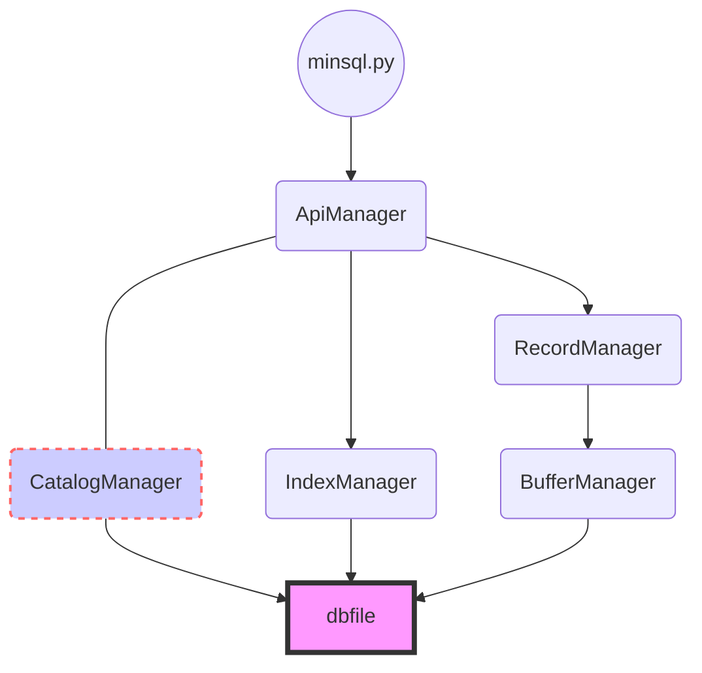

# MiniSQL 实验报告

> 章启航 
>
> 3170104343
>
> 求是科学班（计算机）1701

## 概论

该MiniSQL数据库仿照mySQL数据库设计，使用命令行与用户交互，支持表的建立，删除；索引的建立与删除以及记录的插入，查询与删除。

本实验在`Windows 10` `Python 3.6.4`环境下开发。

## 总体框架

该数据库以minisql.py为入口，包含了 ApiManager, CatalogManager, RecordManager, IndexManager,  BufferManager模块。它们各司其职，分工明确，以使程序逻辑清晰高效，降低耦合。

| 模块名称           | 功能介绍                                                     |
| ------------------ | ------------------------------------------------------------ |
| **minisql.py**     | 整个程序的入口，负责读取命令行键入的命令，进行简单的处理后，对于`select` `delete` `insert` `create` `drop` 调用**ApiManager**；对于`help` `execfile`执行相应逻辑。 |
| **ApiManager**     | 调取**CatalogManager**中的有关表头的信息，结合处理过后的输入语句，调用**IndexManager**, **RecordManager**, **CatalogManager**提供的相应的接口进行执行。如果中途出现错误（例如用户输入语法不正确，用户试图删除一个不存在的记录），将抛出异常返回**minsql.py**。 |
| **CatalogManager** | 管理表头信息，包括：所有表的属性的信息，所有表的primary key信息，存在索引的属性的信息。 同时提供接口供外界调用从而获取表格信息。 |
| **IndexManager**   | 管理表格中的索引信息，对于每一个索引维护一颗B+树。 对于B+树，提供创建、插入与删除操作。 |
| **RecordManager**  | 管理记录表中的数据文件。主要功能包括数据记录的插入、删除与读取（调用**BufferManager**中的相应方法）。同时也提供了一个根据条件进行选择打印数据的函数以及一个根据条件进行选择删除数据的函数供**ApiManager**中的相应功能调用。 |
| **BufferManager**  | 与真实的数据文件进行交互。为**RecordManager**提供写入数据、删除数据和读取数据的接口。同时为了提升程序运行效率，减少与硬盘IO的次数，该模块维护了一个缓冲区，利用`LRU`的思想来对数据进行管理。 |



## 各个模块具体功能与接口

+ ### minisql.py

  1. 创建一个继承自cmd.Cmd的类miniSQL。cmd是python的一个库，它为实现命令行解释器提供了一个简单的框架。cmd.Cmd类便是命令行解释器的基类，它提供了很多基础的方法，因此我将自己的解释器继承它。

  ```python
  class miniSQL(cmd.Cmd):
  	intro = 'Welcome to the MiniSQL database server.\nType help or ? to list commands.\n'
  	
  	def init(self):
  		ApiManager.api.init()
          
  	def finalize(self):
  		ApiManager.api.finalize()
  
  	def emptyline(self):
  		pass
  
  	def do_execfile(self, line):
  		with open(line.rstrip(';')) as f:
  			content = [line.rstrip('\n') for line in f]
  			for command in content:
  				self.default(command)
                  
  	def do_quit(self, line):
          self.finalize()
          print('goodbye')
          sys.exit()
                  
  	def help_insert(self):
  	def help_create(self):
      def help_drop(self):
      def help_select(self):
      def help_delete(self：
  
  	@clock
  	def default(self, line):
  		args, symbol = line, line.split()[0]
  		if (symbol not in ['select','create','drop','insert','delete','quit','execfile']):
  			print('Unrecognized command.')
  			return
  		while (args.find(';')==-1):
  			print('.......>',end='')
  			args += (' '+input())
  		try:
  			args = args.replace('>=',' >= ').replace('<=',' <= ').replace('<>',' <> ')
  			args = re.sub('<(?![=>])',' < ',args)
  			args = re.sub('(?<!<)>(?!=)',' > ',args)
  			args = re.sub('(?<![<>])=',' = ',args)
  			args = re.sub(r' +', ' ', args.replace(';','')).
              args = args.strip().replace('\u200b','')
  			words = [word for word in re.split(' |\(|\)|,',args) if word!='']
  			eval('ApiManager.api.'+symbol)(words)
  		except Exception as e:
  			print(str(e))
  ```

  

  在命令行中输入命令形如： abcd xxxxxxx xx yy; 解释器会到类中寻找`do_abcd`的方法，如果没有找到就会调用`default`方法。这里我为了压缩代码，将本应单独写出来的`do_help`, `de_insert`等全部压入`default`中，在`default`中通过 

```python
eval('ApiManager.api.'+symbol)(words) 
```


​		调用**ApiManager**提供的相应接口。

​		2. 我实现了一个装饰器`clock`来输出函数运行时间。用`clock`装饰default就可以打印出每条语句执行的时间。

```python
def clock(func):
    def int_time(*args, **kwargs):
        start_time = datetime.datetime.now()
        func(*args, **kwargs)
        over_time = datetime.datetime.now() 
        total_time = (over_time-start_time).total_seconds()
        print('Ran successfully. Passed {} s'.format(total_time))
    return int_time
```

​		3. 直接此程序就会进入命令行循环。

```python
if __name__ == '__main__':
	miniSQL().init()
	miniSQL.prompt = 'MiniSQL>' 
	miniSQL().cmdloop()
```

​           `miniSQL().init()`会调用**ApiManager**中的`init()`方法。

- ### ApiManager

  1. API 模块是整个系统的核心，其主要功能为提供执行 SQL 语句的接口，供 **minisql.py** 层调用。该接口以 **minisql.py** 解释生成的命令内部表示为输入，根据 **CatalogManager** 提供的信息确定执行规则，并调用 **RecordManager**、**IndexManager **和 **CatalogManager **提供的相应接口进行执行，最后返回执行结果给 **minisql.py** 模块。

  2. 模块接口：

     create：表格或索引的插入

     drop：表格或索引的删除

     insert：记录的插入

     select：记录的选择

     delete：记录的删除

  3. 因为几个模块接口的实现思路都是一致的： 排查错误 + 调用别的模块接口综合资源执行命令， 因此我将以`drop`为例简要说明代码逻辑。

  ```python
  def drop(words):
  	if words[1]=='table':
  		CatalogManager.catalog.exist_table(words[2], False)
  		IndexManager.index.delete_table(\
  			words[2],CatalogManager.catalog.get_index_list(tablename))
  		CatalogManager.catalog.delete_table(words[2])
  		RecordManager.record.delete_table(words[2])
  	elif words[1]=='index':
  		tablename=IndexManager.index.delete_index(words[2])
  		CatalogManager.catalog.delete_index(tablename,words[2])
  	else:
  		raise Exception('[table/index] expected, but '+words[1]+' found.')
  ```

  ​		首先最外层是一个`if`语句，如果输入的第二个单词不是`table``index`的话（第一个单词是`drop`的前提下），就抛出异常。

  ​		如果第一个单词是`table`, 调用**CatalogManager**提供的接口检查是否存在名称对应的表格, 如果没有，        则会在该方法中抛出异常。 随后调用**IndexManager**提供的接口将属于该表的所有索引删除，再调用**CatalogManager**提供的接口删除表头信息， 最后调用**RecordManager**提供的接口删除该表下的数据文件。至此删除表格的功能就全部完成了。删除索引的实现类似，这里不再赘述。

+ ### CatalogManager

  1. Catalog Manager负责管理数据库的所有模式信息，包括：

     a. 数据库中所有表的定义信息，包括表的名称、表中字段（列）数、主键、定义在该表上的索引。

     b. 表中每个字段的定义信息，包括字段类型、是否唯一等。

     c. 数据库中所有索引的定义，包括所属表、索引建立在那个字段上等。

  2. 模块接口：

     create_table ( tablename , attributes , primary ): 添加新创建的表格的表头信息

     create_index( tablename , indexname , columnname ): 在对应表格中添加新创建的索引的信息

     delete_table ( tablename )：删除相应的表格的表头信息

     exist_table ( tablename , boolean ): 检查表格是否存在

     delete_index ( tablename , indexname ): 在对应的表格中删除索引信息

     get_encode_size ( tablename ): 计算表格中每条数据的存储数据长度

     check_type ( tablename , input_list ): 检查输入值是否与其类型吻合

     get_index_list ( tablename ): 返回一个表格的所有索引名

     get_the_index_of_attribute ( tablename , attribute_name ): 返回一个表格的某个属性的次序

     get_type_of_attribute ( tablename , attribute_name ): 返回一个表格的某个属性的数据类型

     get_column_name ( tablename ): 返回一个表格的所有属性名字

     get_index_name_by_seq ( tablename , index ): 根据属性的次序返回建立在该属性上的索引名称

  3. CatalogManager中的接口提供的都是简单的检查或是返回表头的某种信息，因此实现起来都比较简单，这里仅以`get_type_list()`为例：

     ```python
     def get_type_list(tablename):
     	return [x[0] for x in  tablelist[tablename]['columns'].values()]
     ```

+ ### IndexManager

  1. **IndexManager**负责B+树索引的实现，实现B+树的创建和删除（由索引的定义与删除引起）、等值查找、插入键值、删除键值等操作，并对外提供相应的接口。

  2. B+树中，每个叶子节点的键值就是该记录中用来查询的属性值，而存储的数据是该条记录在数据记录文件中对应的位置（在**RecordManager**中做插入后通过`fp.tell()`返回）。

  3. 我使用了`json`的形式来储存`B+`树， 因为`python`的`json`模块提供函数可以将字典类型数据转换为字符串类型从而保存在文件中，同时也提供了将字符串转换为字典的函数，这使得B+树的存储非常简单。

     ```json
     {"is_leaf": false, "keys": [3], "sons": [{"is_leaf": true, "keys": [1, 2], "sons": [0, 766]}, {"is_leaf": true, "keys": [3, 4, 5], "sons": [1532, 2298, 3064]}]}
     ```

     我创建了一个类来表示`B+`树中的每一个节点：

     ```python
     class Node():
     	def __init__(self, is_leaf, keys, sons,\ 
                      parent = None, left = None, right = None):
     		self.is_leaf = is_leaf
     		self.keys = keys
     		self.sons = sons
     		self.parent = parent
     		self.left = left
     		self.right = right
     ```

     将一棵树（根节点node）转化为json形式：

     ```python
     def save_tree_into_json(root):
     	m = {}
     	m['is_leaf'] = root.is_leaf
     	m['keys'] = root.keys
     	m['sons'] = [(save_tree_into_json(x)) for x in root.sons]\
         			if m['is_leaf']==False else root.sons
     	return m
     ```

     从json中读取一棵树：

     ```python
     def load_tree_from_json(j,parent=None):
     	if j['is_leaf']==True:
     		node = Node(j['is_leaf'],j['keys'],j['sons']) 
     	else:
     		node = Node(j['is_leaf'],j['keys'],\
                         [create_tree_from_json(x) for x in j['sons']])
     		for son in node.sons:
     			son.parent = node
     	return node
     ```

     因为字典（`json`）中只存储了每个节点的键值和儿子，没有存储左右兄弟节点（否则会造成无限循环）。

     因此在从`json`中读取一棵树后，我们还需要将它的每个节点的左右兄弟维护好（便于后续操作）。

     ```python
     prev = None
     def maintain_left_right_pointer(node):
     	global prev
     	if node!=None:
     		if node.is_leaf:
     			if prev!=None:
     				prev.right = node
     				node.left = prev
     			prev = node
     		else:
     			for x in node.sons:
     				maintain_left_right_pointer(x)
     	node.right = None
     ```

  3. 模块接口

     delete_all ( tablename , indexname ): 删除一个表格的一个索引

     delete_entries ( keylist , tablename, indexname ): 在一个表格中，按照一个索引删除若干节点

     insert_entry ( tablename , indexname , key , data ): 在一个表格中，按照一个索引添加一个节点

     select ( tablename , clause , indexname ): 在一个表格中，按照条件语句做选择操作，返回符合条件的节点的存储数据

     create_index ( tablename , indexname , res ): 为一个表格的某个属性添加索引

     delete_index ( indexname ): 删除索引

     delete_table ( tablename , list ): 删除表格， 删除该表格的所有索引

     create_table ( tablename , indexname ): 创建表格， 为该表格的主码创建索引

     get_rightest_child ( node ): 返回一棵树叶子节点中最小（左）的节点

     delete ( node , key ): 删除叶子节点

     delete_node(node, index): 删除非叶子节点键值

     insert ( node , key , data , is_insert = True ): 添加节点 （is_insert为False时是伪插入，在做select等值查询操作的时候会被调用）

     insert_into_parent ( node1 , node2 ): 向非叶子节点插入键值

     insert_into_leaf ( node, _key , data , is_insert = True ): 向叶子节点插入节点

     find_leaf_place ( node , value ): 返回需要做插入/删除的叶子节点

+ ### RecordManager

  1. **RecordManager**负责管理记录表中数据的数据文件。主要功能为实现数据文件的创建与删除（由表的定义与删除引起）、记录的插入、删除与查找操作，并对外提供相应的接口。其中记录的查找操作要求能够支持不带条件的查找和带一个条件的查找（包括等值查找、不等值查找和区间查找）。

  2. **RecordManager**中所有对数据的写入与删除都需要调用**BufferManager**提供的接口，而非直接对文件进行操作。

  3. 对于数据的删除，我使用了懒惰删除方式（lazy delete）。即对于每一个数据前面，我都添加了一个`valid bit` 。如果`valid bit`为1 则表示数据有效，为0表示数据无效。因此删除操作就仅需要将某条数据的`valid bit`改为0。

     这样设计的理由是，如果采取直接删除的话，删除数据后面每一条数据的起始位置都会发生改变，需要去B+树中进行修改，比较繁琐。

  4. 模块接口

     create_table ( tablename ): 创建表格的存储数据文件

     delete_table ( tablename ): 删除表格的存储数据文件

     insert ( tablename , values ): 插入数据

     decrypt ( code ) : 将读取出的`byte`转化为`string`，返回`valid bit`和存储数据

     truncate ( tablename , where ): 将文件规定位置后的记录删除（用于在更新B+树时发现键值冲突后删除刚刚插入的数据）

     print_record ( tablename , columnname , clauses , res , length ): 根据条件打印数据

     delete_record ( tablename , clauses , length ): 根据条件删除数据 

     create_index ( tablename , id , type , length): 在增加索引时候，返回所有数据记录以供新B+树的建立

+ ### BufferManager

  1. Buffer Manager负责缓冲区的管理，主要功能有：根据需要，读取指定的数据到系统缓冲区或将缓冲区中的数据写出到文件； 实现缓冲区的替换算法，当缓冲区满时选择合适的页进行替换。

  2. 我用有序字典来模拟系统缓存区，同时规定了系统缓存区的block数。

     ```python
     cache = collections.OrderedDict()
     cache_size = 1000
     ```

     当缓存区中的记录数目达到最大缓存数（block数），我使用根据`LRU`（`Least Recently Used`）来进行替换。借助有序字典的特性能够很好地实现LRU。通过`cache.popitem(last = False) `可以弹出最先进入的元素，从而为当前记录腾出空间。
     
  3. 模块接口：
  
     save_block ( tablename , code): 保存记录
  
     get_block ( tablename , where  , length ): 读取记录
  
     truncate ( tablename , where ): 截断记录（删除`where`以后的记录）
  
     change_valid_bit ( tablename , loc ): 改变loc处记录的`valid_bit`
  
  4. cache机制的具体实现：
  
     `save_block`中，当写入一条记录后，立即将该记录写入`cache`。
  
     ```python
     def save_block(tablename, code):
     	with open(path+tablename+'.rec','rb+') as fp:
     		fp.read()
     		if len(cache)==cache_size:
     			cache.popitem(last=False)
     		cache[tablename+'\0'+str(fp.tell())] =\
             		code.encode(encoding='UTF-8',errors='strict')
     		fp.write(cache[tablename+'\0'+str(fp.tell())])
     		return(fp.tell())
     
     ```
  
     `get_block`中，首先在`cache`中查询是否有对应记录，如果有，取出，否则在文件中读取然后保存入`cache`。
  
     ```python
     def get_block(tablename, where, length):
     	if tablename+'\0'+str(where) in cache:
     		return cache[tablename+'\0'+str(where)]
     	with open(path+tablename+'.rec','rb+') as fp:
     		fp.seek(where)
     		if len(cache)==cache_size:
     			cache.popitem(last=False)
     		cache[tablename+'\0'+str(where)] = fp.read(length)
     	return cache[tablename+'\0'+str(where)]
     ```
  
     